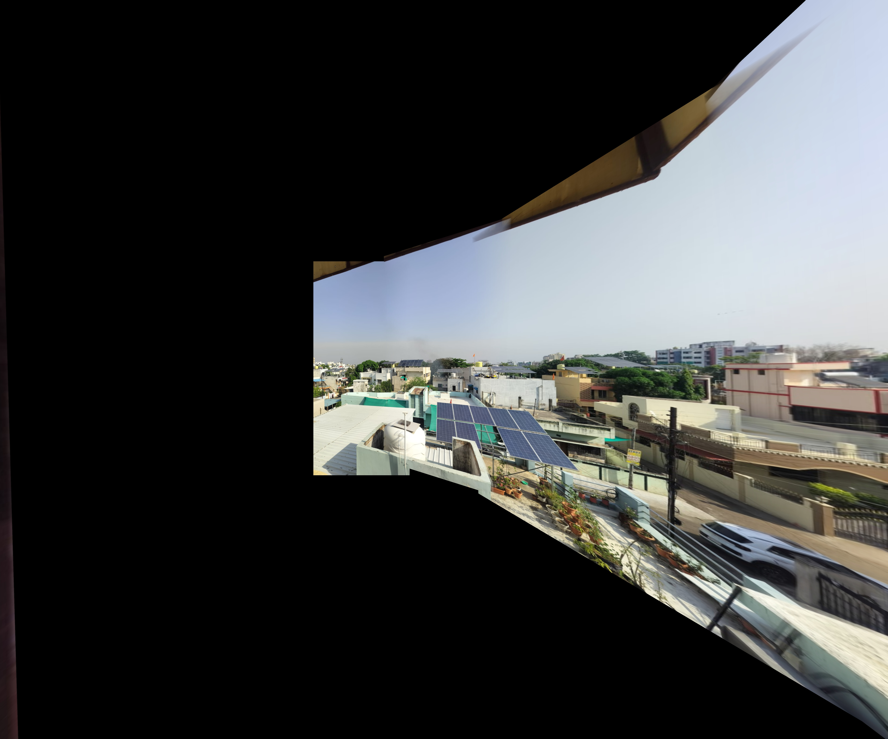

# PanoramaWeave 

- Output: 



## API Reference

### `POST /stitch`

Stitches multiple overlapping images into a panorama.

**Form-data fields:**

| Field       | Type    | Default       | Description                                 |
|-------------|---------|---------------|---------------------------------------------|
| `images[]`  | files   | required      | 2+ image files, ordered left → right        |
| `nfeatures` | int     | `3000`        | ORB keypoint count per image                |
| `ransac`    | float   | `5.0`         | RANSAC reprojection threshold (px)          |
| `ratio`     | float   | `0.75`        | Lowe's ratio test threshold                 |
| `blend`     | string  | `laplacian`   | Blending mode: `laplacian`, `distance`, `alpha` |
| `crop`      | string  | `auto`        | Crop mode: `auto`, `tight`, `none`          |
| `opencv`    | string  | `1`           | Also run OpenCV stitcher: `1` or `0`        |

**Response (JSON):**

```json
{
  "custom": {
    "image": "data:image/jpeg;base64,...",
    "width": 2400,
    "height": 640,
    "n_frames": 3,
    "skipped": 0,
    "inlier_counts": [412, 387],
    "blend_mode": "laplacian",
    "crop_mode": "auto"
  },
  "opencv": {
    "image": "data:image/jpeg;base64,...",
    "width": 2380,
    "height": 620,
    "status": "ok"
  }
}
```

If OpenCV stitching fails, `opencv.image` is `null` and `opencv.status` contains the reason.

### `GET /health`

Returns `{"status": "ok", "opencv_version": "4.x.x"}`.

---

## Connecting to the Frontend

In the frontend (`static/index.html`), replace the simulated `runStitch()` function with a real `fetch`:

```javascript
async function runStitch() {
  const form = new FormData();
  photos.forEach(p => form.append("images[]", p.file));   // p.file = File object
  form.append("nfeatures", document.getElementById("p-orb").value);
  form.append("ransac",    document.getElementById("p-ransac").value);
  form.append("ratio",     document.getElementById("p-ratio").value);
  form.append("blend",     document.getElementById("p-blend").value.toLowerCase());
  form.append("crop",      document.getElementById("p-crop").value.toLowerCase());
  form.append("opencv",    "1");

  const res  = await fetch("/stitch", { method: "POST", body: form });
  const data = await res.json();

  // Show result
  document.getElementById("result-img").src = data.custom.image;
}
```

---

## Project structure

```
panorama_flask/
├── app.py              ← Flask backend (this file)
├── requirements.txt
├── README.md

```

---

## Pipeline overview

```
Upload photos (ordered left → right)
        │
        ▼
ORB keypoint detection (FLANN-LSH matching)
        │
        ▼
RANSAC homography between consecutive pairs
        │
        ▼
Chain homographies → global canvas
        │
        ▼
Warp all images onto canvas
        │
        ▼
Laplacian pyramid blending (or distance-weighted / alpha)
        │
        ▼
Auto-crop black borders
        │
        ▼
Return base64 JPEG + metadata
```
